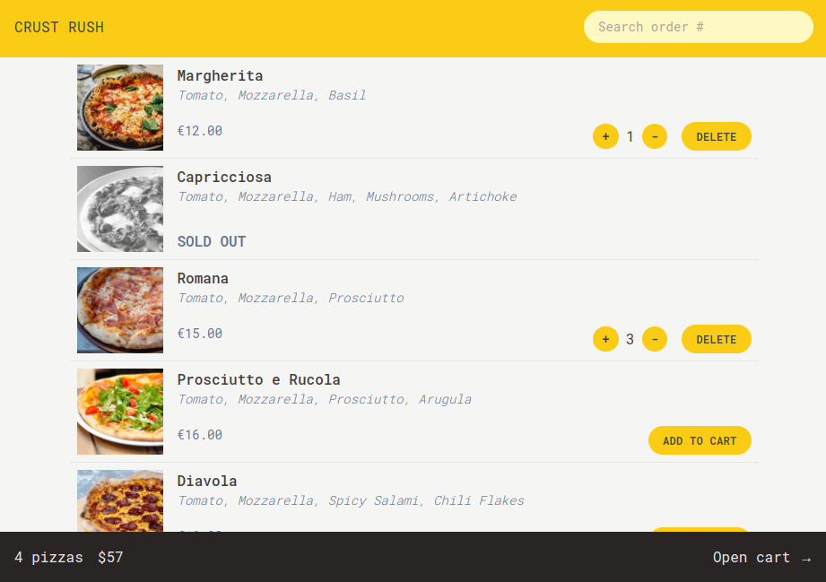
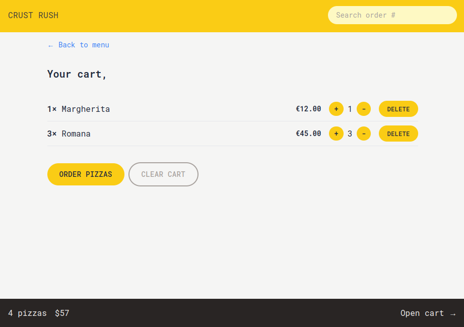
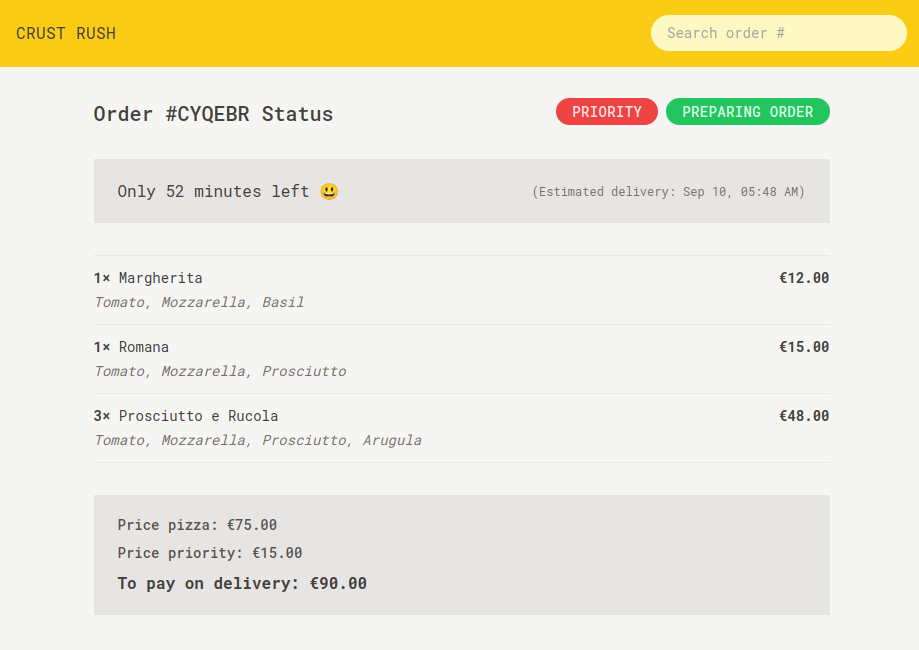

# CrustRush 🍕

**CrustRush** is a SPA for pizza ordering built with React. It fetches pizza menu data from an external API, allows users to add pizzas to cart, adjust quantities, prioritize orders, and track the status of their order in real-time through a mock API.

## Features

- **Browse Pizza Menu**: Fetches a list of pizzas from an external API.

- **Add to Cart**: add pizzas to the cart.

- **Quantity Control**: Increase or decrease the number of pizzas before placing an order.

- **Order Priority**: Mark an order as a priority, which moves it ahead of others but increases the total price by 20%.

- **Track Your Order**: Search for the status of your order using your order ID, including estimated delivery time.

- **Change Order Priority**: Update the priority status of an order even after placing it.

- **Real-time Status**: Displays order status and remaining time using a fake API for demonstration purposes.

## Demo

[Link to live demo]

## Screenshots

1. **Pizza Menu**
   
2. **Cart**
   
3. **Order Tracking**
   

## How to run locally

```bash
    npm install
    npm run dev
```

## Technologies Used

   
